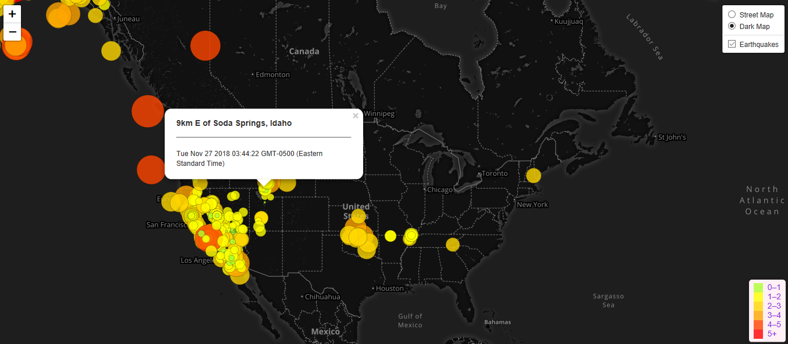

# Visualizing-Data-with-Leaflet
Visualizing Earthquake Data with Leaflet. Technologies => Javascript, Leaflet.js, HTML, CCS, Heroku PHP deployment 

• The data is sourced from U.S. Geological Survey (USGS) site, the USGS provides earthquake data in different formats, updated every 5 minutes. On the USGS GeoJSON Feed page and when you click on 'All Earthquakes from the Past 7 Days', you will be given a JSON representation of that data.

• Imported & Visualized the Data.

• Created a map using Leaflet that plots the earthquakes from data set based on their longitude and latitude.

• Data markers reflect the magnitude of the earthquake in their size and color. Earthquakes with higher magnitudes appear larger and darker in color.

• Included popups that provide additional information about the earthquake when a marker is clicked.

• Created a legend that will provide context for your map data.
